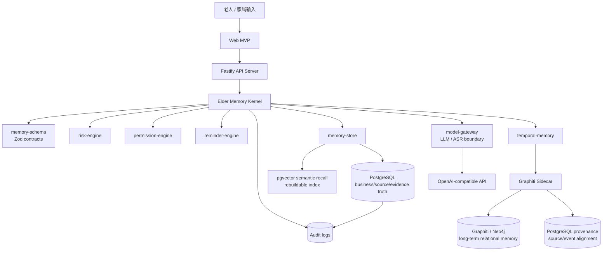
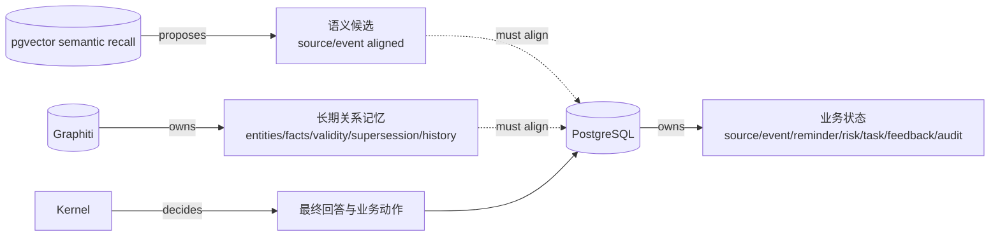
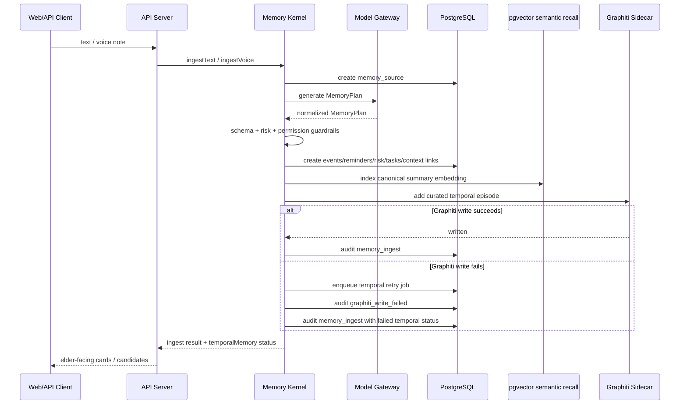
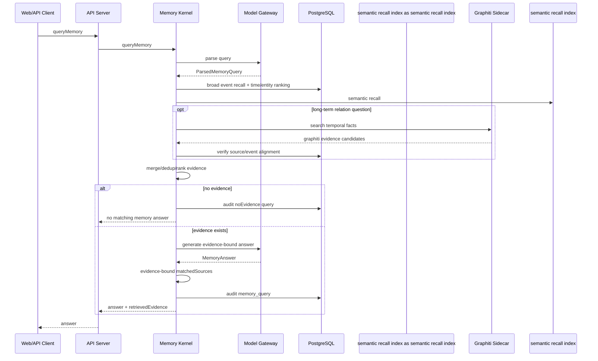
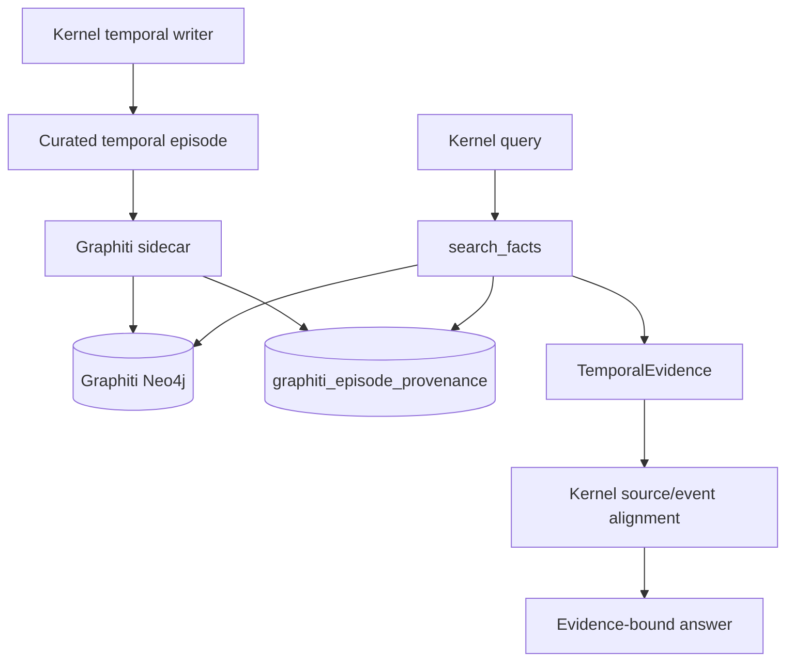

# GoldMem 当前能力与架构总览

本文总结 GoldMem 当前代码库已经具备的能力、模块职责、核心边界和验证门禁。它面向工程协作与 AI coder 维护，目标是让后续修改能快速定位 owner，并避免破坏 `AGENTS.md` 中定义的架构约束。

## 1. 当前产品能力

GoldMem 当前已经形成一个可运行的老人记忆与提醒 MVP：

- 老人或家属输入文本/语音来源，系统保存原始 source 证据。
- 模型生成 `MemoryPlan`，Kernel 进行 schema 校验、风险约束、权限约束和确定性落库。
- PostgreSQL 保存业务 truth：source、event、reminder、risk flag、family task、context link、feedback、audit、Graphiti retry job。
- pgvector semantic recall index 作为低延迟召回索引，写入 PostgreSQL 派生摘要和 embedding。
- Graphiti 作为长期关系/时间记忆核心路径，通过 sidecar 写入 curated temporal episode，并通过 Postgres provenance 对齐 source/event。
- Query 通过 PostgreSQL、pgvector semantic recall、Graphiti 合并证据后生成答案；无 evidence 时不编造答案。
- 提醒确认、家属任务确认、风险 review 均由确定性 engine/store/API path 控制。
- Graphiti 写失败会进入 retry job，并通过 audit 和 ingest result 暴露。
- Web MVP 提供中文优先的单页控制台：保存记忆、询问回忆、查看事件/提醒/家属任务、确认提醒/任务。

## 2. 模块职责

| 模块 | 当前职责 | 不能做的事 |
|---|---|---|
| `apps/web-mvp` | 中文单页 MVP UI，通过 `src/lib/api.ts` 调 API | 不能复制 Kernel 规则，不能直接调用 semantic recall index/Graphiti |
| `services/api-server` | Fastify HTTP adapter、请求解析、依赖装配、健康检查 | 不能直接写业务 truth，不能绕过 Kernel 生成回答 |
| `packages/memory-kernel` | ingest/query orchestration、guardrails、evidence fusion、audit、Graphiti episode 构建 | 不能实现通用图引擎，不能让 provider 直接裁决业务 truth |
| `packages/memory-schema` | Zod schema 与共享领域类型 | schema 变更不能只在 adapter 层私自处理 |
| `packages/memory-store` | PostgreSQL truth adapter、pgvector semantic recall store、Graphiti retry job store | 不能依赖 model-gateway，不能暴露 provider 内部图为业务 truth |
| `packages/model-gateway` | OpenAI-compatible LLM/ASR 边界，规范化模型输出并做 schema validation | 不能写 truth，不能把 malformed answer 当成功输出 |
| `packages/temporal-memory` | Graphiti-targeted temporal memory interface 与 adapter | 不能触发提醒/通知/权限/风险状态改变 |
| `packages/risk-engine` | 医疗、金融、诈骗、身份、密码等确定性风险约束 | 不能依赖 prompt 作为唯一安全机制 |
| `packages/permission-engine` | visibility 与 family sharing 默认约束 | 不能由 UI 或模型决定最终权限 |
| `packages/reminder-engine` | reminder candidate/confirmation 状态机 | 不能自动确认 ambiguous reminder |
| `services/graphiti-sidecar` | Graphiti REST sidecar、Neo4j 后端访问、Postgres provenance readback | 不能成为业务 action owner |

## 3. 总体架构



### Truth 边界



## 4. Ingest 流程



### Ingest 已具备的安全特性

- 模型只能输出 `MemoryPlan`，不能直接写 business truth。
- `MemoryPlan` 必须经过 Zod schema 校验。
- medication/medical/financial/fraud/identity/password 等风险由 `risk-engine` 约束。
- visibility 与 family sharing 由 `permission-engine` 约束。
- reminder candidate 由 `reminder-engine` 管理，ambiguous time 不会自动确认。
- Graphiti 写入发生在 PostgreSQL truth 已存在之后，因此 episode 带稳定 `sourceId/eventId`。
- Graphiti 写失败不回滚 PostgreSQL truth，但必须 retry/audit/response-visible。

## 5. Query / Recall 流程



### Query 已具备的安全特性

- `eventTypes` 是 ranking signal，不是硬过滤。
- semantic recall index result 必须通过 PostgreSQL-derived metadata/sourceId/eventId 对齐后才能进入 final evidence。
- Graphiti raw evidence 必须带 source/event/episode alignment，并通过 PostgreSQL tenant/elder/source 验证。
- Graphiti provenance fallback 只作为可追溯补充证据，进入 final evidence 时标记为 `graphiti_provenance`，不计为 raw Graphiti temporal reasoning。
- no evidence 时返回无匹配记忆，不生成虚构答案。
- `matchedSources` 只允许映射到已有 evidence。
- Graphiti search failure 会 audit，不会无声吞掉。

## 6. Graphiti 核心路径

Graphiti 当前不是可选展示层，而是长期关系记忆核心路径：

- `packages/temporal-memory` 定义 `TemporalMemoryStore` 和 `GraphitiTemporalMemoryStore`。
- `services/graphiti-sidecar` 包装 `graphiti-core`，提供 REST contract。
- sidecar 使用独立 Neo4j，不混用 semantic recall index 内部 Neo4j。
- sidecar 写 episode 时同时持久化 `graphiti_episode_provenance`。
- Graphiti search 结果标记为 `origin=graphiti_raw`，provenance readback 标记为 `origin=provenance_fallback`。
- Kernel 将 raw Graphiti 结果映射为 `retrievalSource=graphiti`，将 provenance readback 映射为 `retrievalSource=graphiti_provenance`。
- `pnpm test:graphiti` 会读取 `.env`，启动本地 Graphiti profile，执行真实 write/search smoke。
- `pnpm mvp:verify` 默认包含 Graphiti readback gate。



## 7. 验证门禁

当前核心门禁：

```bash
pnpm typecheck
pnpm test
pnpm test:postgres
pnpm test:graphiti
pnpm build
pnpm lint
pnpm eval
pnpm architecture:check
pnpm mvp:verify
```

`pnpm mvp:verify` 当前包含：

```text
typecheck
unit tests
real PostgreSQL readback
Graphiti readback
build
lint
eval
architecture check
```

重要补充：

- `pnpm test:postgres` 会验证 PostgreSQL truth readback 和 temporal retry job store。
- `pnpm test:graphiti` 会验证 Graphiti sidecar 健康、episode write、search provenance readback。
- `pnpm architecture:check` 会阻止 semantic recall index `infer=true`、semantic recall index truth 叙述、Kernel 对 Null temporal store 的静默分支、核心入口超大化、安全 owner `--passWithNoTests` 等问题。

## 8. 当前实现度评价

| 能力 | 实现度 | 说明 |
|---|---:|---|
| Text ingest | 高 | 已可从 transcript 生成 source/event/reminder/risk/task/audit |
| Voice ingest | 中 | API 和 ASR gateway 已有，真实音频产品体验仍需完善 |
| Reminder candidate / confirmation | 高 | 状态机、API、audit、Web 控制已具备 |
| Risk / permission guardrails | 高 | 有独立 engine 和 focused tests |
| PostgreSQL truth store | 高 | 真实 readback gate 已纳入 MVP 验证 |
| semantic recall index recall | 中高 | canonical summary write 和 metadata-aligned recall 已具备 |
| Graphiti long-term memory | 中高 | write/search/readback gate 已具备，nightly consolidation 尚未实现 |
| Query evidence fusion | 中高 | PostgreSQL + semantic recall index + Graphiti evidence merge 已具备 |
| Family workflow | 中 | pending task 与 confirm 已具备，完整通知/协作产品面仍待扩展 |
| Eval flywheel | 中 | eval runner、golden e2e fixture 已有，自动 failure-to-eval 仍待建设 |
| Admin/debugger | 低 | audit 已有，但尚无完整可视化 replay/debugger |

## 9. 主要后续方向

1. 修正旧 roadmap 文档中关于 `NullTemporalMemoryStore` no-op 和 temporal memory 未接入 runtime 的过时描述。
2. 收紧 API health：只要配置 Graphiti，顶层 `ok` 应反映 Graphiti 健康状态。
3. 拆分 `model-gateway/src/normalization.ts`，避免 LLM boundary 文件继续膨胀。
4. 抽出 Kernel 测试 harness，降低大型测试文件对 AI coder 的修改半径。
5. 增加 nightly consolidation：从每日 PostgreSQL truth 生成 curated Graphiti episodes、semantic recall index summaries、family digest 和 eval cases。
6. 建设 admin memory debugger：展示 source、MemoryPlan、guardrail、PostgreSQL writes、semantic recall index/Graphiti evidence、answer、audit trail。

## 10. AI Coder 修改指南

后续修改应遵循以下定位：

- schema/domain contract 改动：先改 `packages/memory-schema`。
- ingest/query orchestration：改 `packages/memory-kernel`，并补 Kernel tests。
- PostgreSQL truth/readback：改 `packages/memory-store`，并跑 `pnpm test:postgres`。
- Graphiti temporal memory：改 `packages/temporal-memory` 或 `services/graphiti-sidecar`，并跑 `pnpm test:graphiti`。
- LLM output shape：改 `packages/model-gateway` normalizer/schema tests，不能把 malformed output 当成功。
- UI/API 交互：Web 只能通过 `apps/web-mvp/src/lib/api.ts` 调已有 API。
- 安全策略：risk/permission/reminder engine 需要 focused tests。

最小合规验证通常是：

```bash
pnpm typecheck
pnpm test
pnpm architecture:check
```

涉及 truth store 或 Graphiti 的变更必须额外跑：

```bash
pnpm test:postgres
pnpm test:graphiti
```
